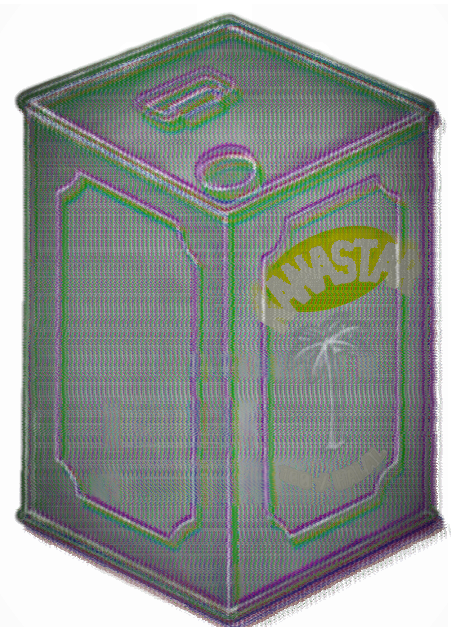

## kanastar
simple, scalable docker orchestrator written in go.

>  "I will show you the home of the defiantly disobedient." (Quran 7:145)

## Architecture Overview

## Usage

- Currently the following subcommands are available:
  - `worker`
  - `manager`
  - `run`
  - `status`
  - `stop`
  - `node`
- To learn how to use each type the subcommand name followed by `-h` or `--help` for details
  - Example: `go run main.go worker -h`

[changelog](./CHANGELOG)
