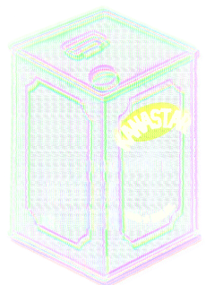
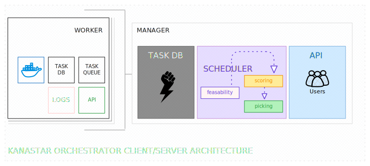

> [!CAUTION]
> Highly experimental release in active development, not suitable for production yet.

# kanastar
simple, scalable docker orchestrator written in go.

[](https://github.com/surajsharma/kanastar/actions/workflows/release.yml) [](https://goreportcard.com/report/github.com/surajsharma/kanastar) [](https://github.com/surajsharma/kanastar/actions/workflows/github-code-scanning/codeql) [](https://github.com/surajsharma/kanastar/actions/workflows/scorecard.yml) [](https://scorecard.dev/viewer/?uri=github.com/surajsharma/kanastar) [](https://opensource.org/licenses/MIT)




## Architecture Overview




## Usage

```
Kanastar is a dead simple docker orchestrator designed with spot VMs in mind

Usage:
  kanactl [command]

Available Commands:
  help        Help about any command
  manager     Manager command to operate a Kanastar manager node.
  node        Node command to list nodes.
  run         Run a new task.
  status      Status command to list tasks.
  stop        Stop a running task.
  worker      Worker command to operate a Kanastar worker node.

Flags:
  -h, --help   help for kanactl

Use "kanactl [command] --help" for more information about a command.
```

## Building

- Pull the repo and run `make build` in the dir with the `Makefile`

[changelog](./CHANGELOG)
